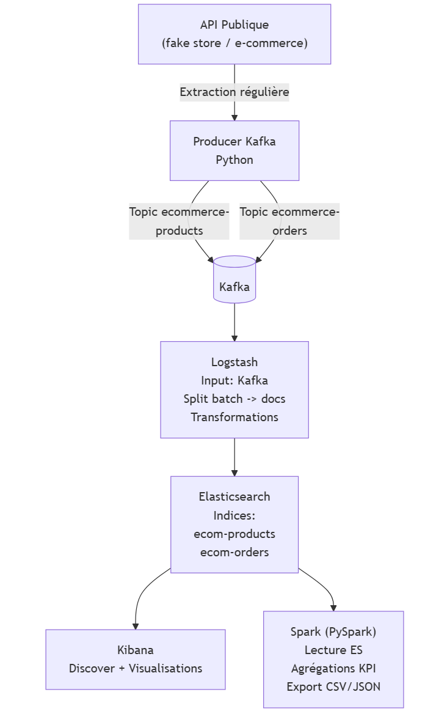

# E-commerce Data Pipeline

Pipeline de données de bout en bout pour des données e-commerce, combinant streaming temps réel, traitements distribués et visualisation — entièrement orchestré avec Docker Compose.



## Stack technique

| Composant | Rôle |
|---|---|
| **Kafka** | Streaming temps réel des événements e-commerce |
| **Logstash** | Transformation et indexation dans Elasticsearch |
| **Elasticsearch** | Stockage et indexation des données |
| **Kibana** | Visualisation et dashboards |
| **Apache Spark** | Traitements distribués et calcul des KPIs |
| **Docker Compose** | Orchestration de l'ensemble de la stack (6 services) |

## Architecture

Le pipeline fonctionne en 4 étapes :

1. **Collecte** — un producer Python génère des événements e-commerce via un cron job
2. **Streaming** — les événements transitent par Kafka en temps réel
3. **Indexation** — Logstash consomme le topic Kafka et indexe dans Elasticsearch
4. **Traitement & visualisation** — Spark lit depuis Elasticsearch, calcule les KPIs et les exporte ; Kibana assure la visualisation

## Résultats (KPIs calculés par Spark)

| Indicateur | Valeur |
|---|---|
| Produits indexés | 200 |
| Commandes traitées | 70 |
| Moyenne d'articles par commande | 6.0 |
| Catégorie top revenus | Men's Clothing (~264 k€ estimés) |
| Produit le plus commandé | Produit #1 (200 unités vendues) |

### Revenus par catégorie

| Catégorie | Revenus estimés | Quantité vendue |
|---|---|---|
| Men's Clothing | 264 643 € | 3 100 |
| Jewellery | 141 098 € | 400 |
| Electronics | 62 400 € | 600 |
| Women's Clothing | 985 € | 100 |

## Lancer le projet

Démarrer la stack complète :

```bash
docker-compose up -d
```

Arrêter :

```bash
docker-compose down
```

> Les résultats Spark sont exportés dans le dossier `/data` (CSV).

## Structure du projet

```
├── producer/          # Producer Kafka (Python + Dockerfile + cron)
├── spark/             # Job Spark — calcul des KPIs
├── logstash/          # Pipeline Logstash (conf)
├── init-elasticsearch/# Templates d'index Elasticsearch
├── data/              # Résultats exportés (CSV)
├── docker-compose.yml # Orchestration de la stack
└── flow.png           # Schéma d'architecture
```

## Contexte

Projet réalisé dans le cadre du Master 2 DataScale — Université Paris-Saclay.
